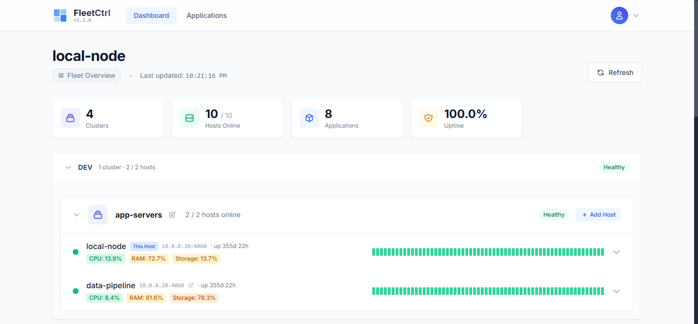
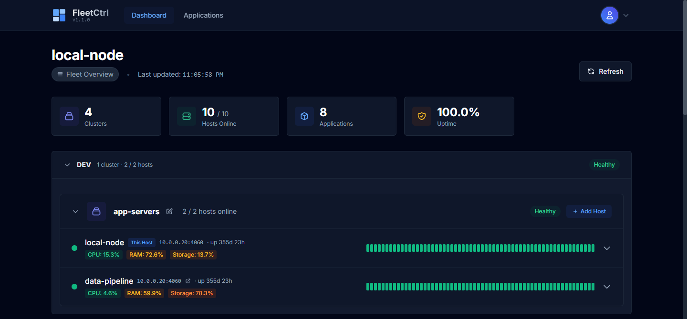
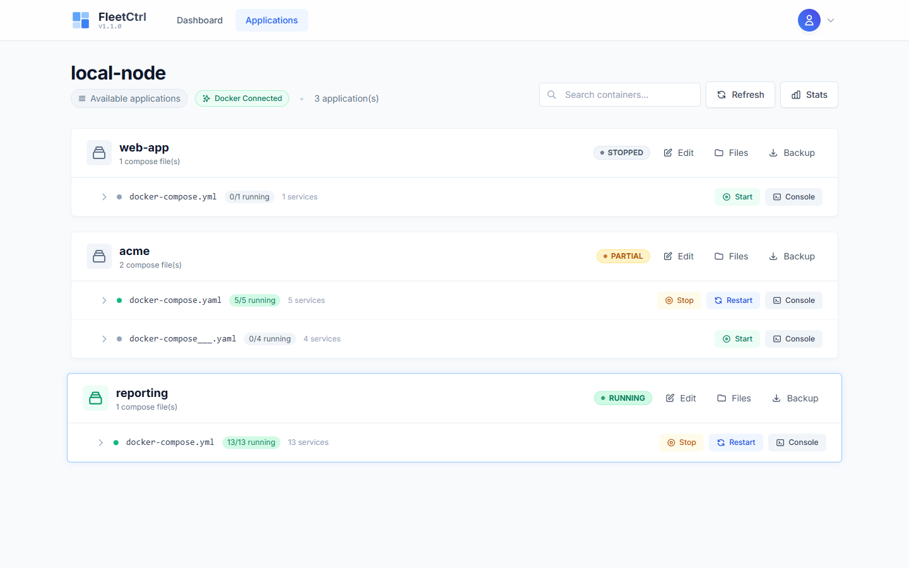
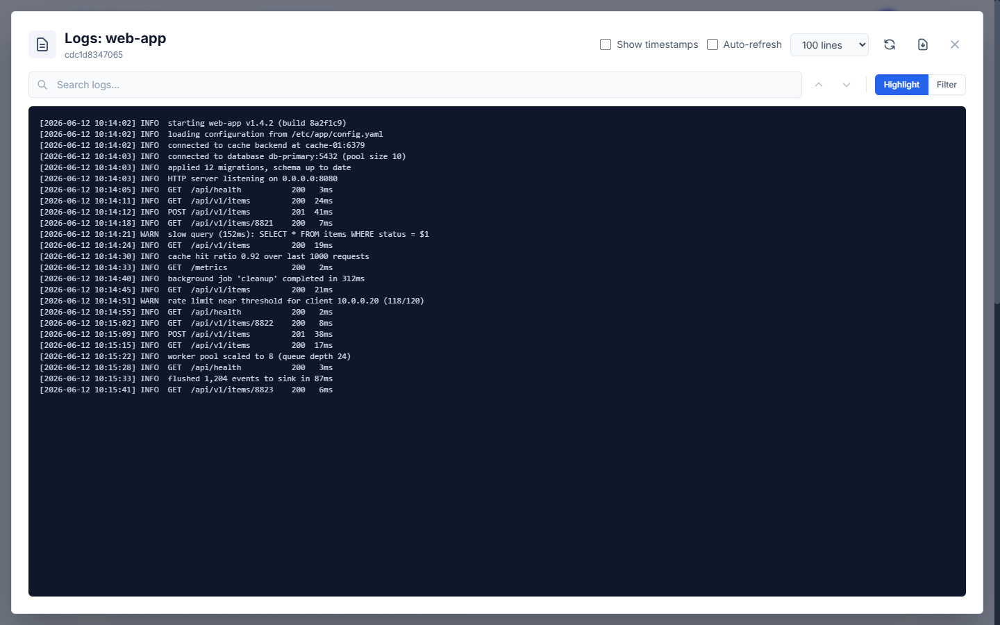
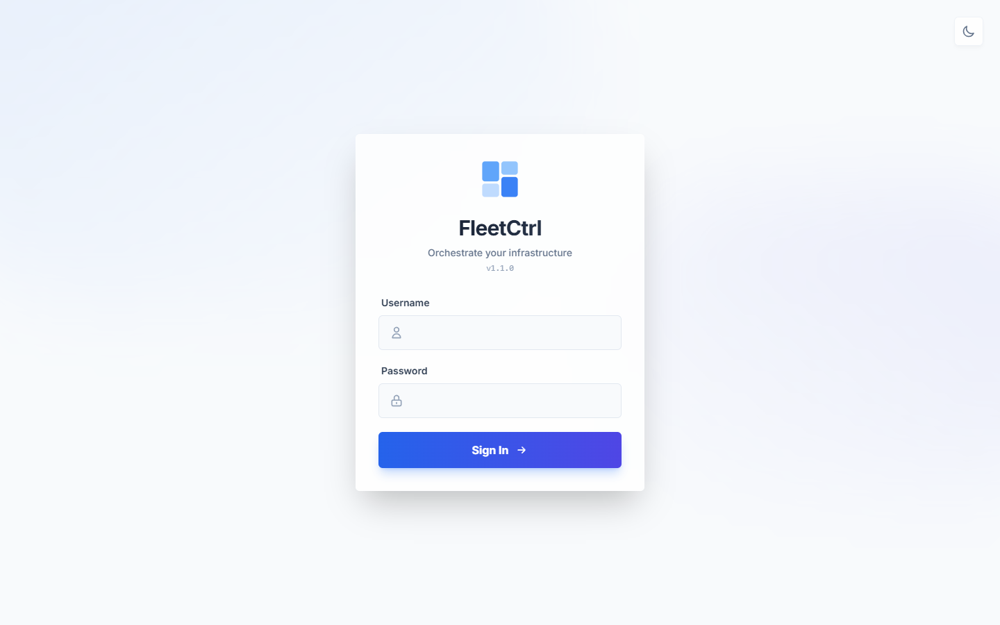

# FleetCtrl Community Edition

A lightweight, cross-platform host monitoring application with a modern web interface. Monitor multiple hosts from a single dashboard with real-time metrics and historical data.

## Screenshots

| Dashboard (light) | Dashboard (dark) |
|-------------------|------------------|
|  |  |
| **Applications** | **Container logs** |
|  |  |
| **Login** | |
|  | |

## Features

### Host Monitoring
- **Real-time metrics**: CPU, memory, storage, and network statistics
- **Multi-host support**: Add and monitor remote hosts from a central dashboard
- **Timeline graphs**: View historical status with visual timeline
- **Dark/Light themes**: Modern UI with automatic theme detection

### Timeseries Database
- **Historical data storage**: Persistent metrics using embedded BoltDB
- **Multi-level aggregation**: Raw, minute, hour, and day aggregates
- **Configurable retention**: Define how long to keep historical data

### Applications (Docker Compose)
- **Compose app management**: Deploy and control folder-based Docker Compose applications
- **Lifecycle controls**: Start, stop, and restart stacks from the web UI
- **Container monitoring & logs**: View container status and stream logs
- **Environment editing**: Edit each application's `.env` directly in the UI

> **Restart behavior:** "Restart" pulls the latest images and runs `up -d`, so new
> image tags and `.env` changes take effect — it is not just a container bounce.

### Security
- **JWT authentication**: Secure token-based authentication
- **Password hashing**: bcrypt for secure password storage
- **Per-host authentication**: Each host maintains independent auth

## Installation

### Pre-built Binaries

Download the latest release for your platform from the [Releases](https://github.com/sharof2000/fleetctrl-ce/releases) page.

### Build from Source

Requirements:
- Go 1.21 or later

```bash
# Clone the repository
git clone https://github.com/sharof2000/fleetctrl-ce.git
cd fleetctrl-ce

# Build for your current platform
go build -o fleetctrl ./cmd/fleetctrl

# Or cross-compile
GOOS=linux GOARCH=amd64 go build -o fleetctrl-linux-amd64 ./cmd/fleetctrl
GOOS=windows GOARCH=amd64 go build -o fleetctrl-windows.exe ./cmd/fleetctrl
```

## Usage

### Starting FleetCtrl

```bash
# Run the binary
./fleetctrl

# Show version
./fleetctrl --version

# Show help
./fleetctrl --help
```

On first run, a default configuration will be created with:
- Default port: 4060
- Default username: admin
- Password set on first login

Open your browser and navigate to `http://localhost:4060`

### Adding Hosts

1. Log in to your FleetCtrl instance
2. Click "Add Host" on the dashboard
3. Enter the host address (e.g., `192.168.1.10:4060`)
4. The host must also be running FleetCtrl

## Configuration

Configuration file locations (checked in order):

**Linux:**
- `./config.yaml`
- `~/.config/fleetctrl/config.yaml`
- `/etc/fleetctrl/config.yaml`

**Windows:**
- `.\config.yaml`
- `%APPDATA%\fleetctrl\config.yaml`
- `C:\ProgramData\fleetctrl\config.yaml`

### Example Configuration

```yaml
app:
  port: "4060"
  log_level: info

auth:
  jwt_secret: "your-secret-key"  # Generated automatically on first run
  users:
    - username: admin
      password_hash: "..."  # bcrypt hash, set on first login

hosts:
  - id: "local-host"
    name: "Local Host"
    address: "localhost:4060"
    is_local: true

database:
  enabled: true
  path: "./fleetctrl.db"
  retention:
    raw_seconds: 3600          # Raw data: 1 hour
    minute_agg_seconds: 86400  # Minute aggregates: 24 hours
    hour_agg_seconds: 604800   # Hour aggregates: 7 days
    day_agg_seconds: 2592000   # Day aggregates: 30 days

dashboard:
  timeline_points: 60
  timeline_interval: 60
  refresh_interval: 5
```

## Roadmap

FleetCtrl Community Edition is actively developed.

### v1.1.0 - Applications (shipped)
- Docker Compose application management
- Container monitoring and logs
- Environment variable editing

### v1.2.0 - Files (planned)
- File manager for application directories
- Configuration file editing with syntax highlighting
- Log file viewing

## Business Edition

FleetCtrl Business Edition builds on the Community Edition with features for teams
running larger, multi-host fleets:

- **Multi-Cluster**: Organize hosts into clusters with peer-to-peer config sync
- **SSO**: Single sign-on across all hosts in a cluster
- **Multi-User & Roles**: Multiple accounts with role-based access control
- **System Services**: Manage system services (systemd, Windows Services)
- **Health Checks**: Pluggable health-check scripts with status and metrics
- **Audit Logging**: Track user and system actions for forensics and compliance
- **Outbound Exporters**: Ship metrics to a central monitoring hub (e.g. Grafana)
- **Docker Swarm & Stacks**: Manage Swarm services and stacks
- **File Manager**: Browse and edit application files with syntax highlighting
- **Priority Support**: Direct support channel

Contact us for more information about Business Edition licensing.

## Attribution

FleetCtrl Community Edition is free and open source under the Apache 2.0 license.

If you use FleetCtrl in your projects or infrastructure, we kindly ask that you keep the "Powered by FleetCtrl" footer visible. This helps spread the word and supports the project's continued development.

## Contributing

Contributions are welcome! Please feel free to submit issues and pull requests.

1. Fork the repository
2. Create your feature branch (`git checkout -b feature/amazing-feature`)
3. Commit your changes (`git commit -m 'Add amazing feature'`)
4. Push to the branch (`git push origin feature/amazing-feature`)
5. Open a Pull Request

## License

Apache License 2.0 - see [LICENSE](LICENSE) for details.

## Support

- **Issues**: [GitHub Issues](https://github.com/sharof2000/fleetctrl-ce/issues)
- **Discussions**: [GitHub Discussions](https://github.com/sharof2000/fleetctrl-ce/discussions)

---

Made with care for the infrastructure community.
